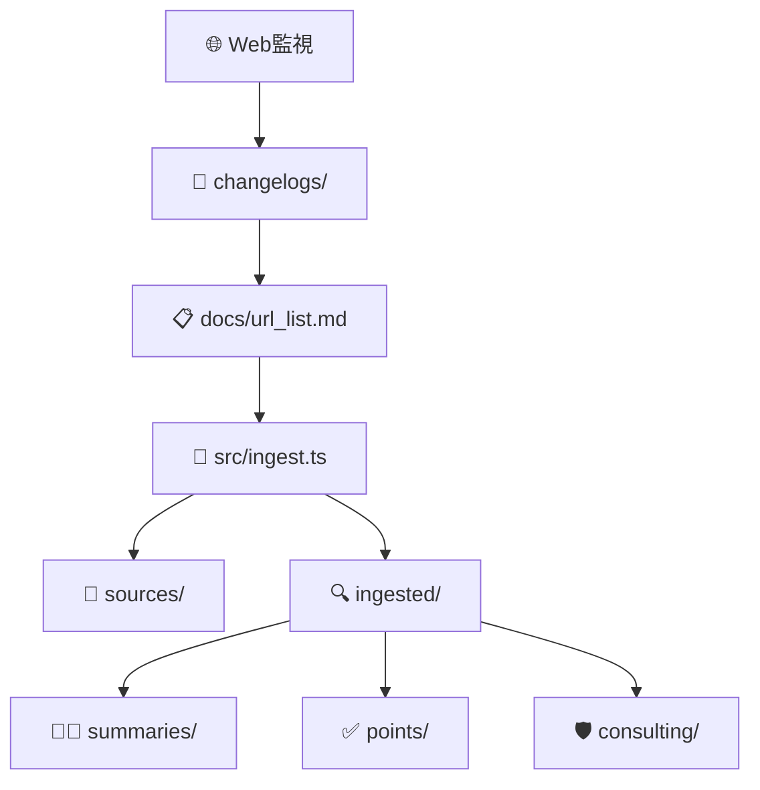

# APPI 関連法令ナレッジベース

日本の個人情報保護法（APPI）および関連法令・ガイドラインの**ローカルナレッジベース**構築・運用システム

## 🎯 目的

- **一次情報の体系的収集**: 官公庁・独法・官報等からの原文取得
- **教師モード**: 初学者向けの噛み砕き要約・用語定義
- **コンサルモード**: 実装・監査で使えるチェックリスト・コントロール表
- **更新追跡**: 法改正・ガイドライン変更の継続監視

## 🚀 クイックスタート

### 🐳 Devcontainer（推奨）

```bash
# VS Code でリポジトリを開く
code .

# コマンドパレット (Ctrl/Cmd + Shift + P)
> Dev Containers: Reopen in Container

# コンテナ起動後、自動で npm install & build 実行
# 準備完了！
npm run ingest
```

### 💻 ローカル環境

```bash
# 依存関係インストール
npm install

# TypeScriptビルド
npm run build
```

### 法令データ取得

```bash
# docs/url_list.md に基づいて全件取得
npm run ingest

# 進捗確認
ls sources/    # 元ファイル（PDF/HTML）
ls ingested/   # 抽出済みテキスト（JSON）
```

## 📁 ディレクトリ構成

```
├── docs/url_list.md        # 📋 取得対象URL一覧（唯一の真実のソース）
├── src/                    # 💻 TypeScriptソースコード
│   ├── ingest.ts          #    メイン取得スクリプト
│   ├── types.ts           #    Zod型定義・スキーマ
│   ├── utils.ts           #    ユーティリティ（slug生成等）
│   ├── parsers.ts         #    Markdown/データ解析
│   └── extractors.ts      #    PDF/HTML抽出エンジン
├── sources/               # 📄 元資料（PDF/HTML保存）
├── ingested/              # 🔍 抽出済みテキスト（JSON形式）
├── summaries/             # 👨‍🏫 教師ロール要約
├── points/                # ✅ 重要ポイント抽出（監査用）
├── consulting/            # 🛡️ セキュリティコンサル助言
├── changelogs/            # 📅 法改正・更新追跡
├── schemas/               # 📐 JSONスキーマ定義
├── newswatch/             # 📰 最新動向監視
└── indices/               # 📚 用語集・逆引き索引
```

## 🔄 データフロー



## 📖 使用方法

### 1. URL 追加・管理

```bash
# docs/url_list.md を編集
echo "| 新しい法令 | https://example.gov.jp/law.pdf |" >> docs/url_list.md

# 差分取得
npm run ingest
```

### 2. 要約・ポイント抽出（今後実装）

```bash
# 教師モード要約生成
npm run summarize

# 監査ポイント抽出
npm run extract-points

# セキュリティコントロール表作成
npm run consulting
```

## 🏗️ 技術スタック

### 🐳 開発環境

- **Devcontainer**: VS Code 統合開発環境
- **Docker**: コンテナ化された統一環境
- **Base Image**: Microsoft 公式 TypeScript/Node.js イメージ

### 言語・ランタイム

- **Node.js** 20+ / **TypeScript** 5+
- **ES Modules** + **Strict TypeScript**

### 主要ライブラリ

- **axios**: HTTP 通信・ファイルダウンロード
- **cheerio**: HTML 解析・テキスト抽出
- **pdf-parse**: PDF 解析・テキスト抽出
- **zod**: 型安全バリデーション・スキーマ定義
- **gray-matter**: Frontmatter 解析

### 開発ツール

- **tsx**: TypeScript 実行環境
- **ESLint**: 静的解析
- **Jest**: テストフレームワーク

## 📐 スキーマ・型定義

### Frontmatter（全.md ファイル必須）

```yaml
---
doc_type: "summary|points|consulting|changelog"
title: "個人情報の保護に関する法律"
source_url: ["https://elaws.e-gov.go.jp/..."]
source_org: ["個人情報保護委員会"]
source_type: "law|guideline|faq|ruling"
source_date: "2024-01-01"
retrieved_at: "2024-01-01"
tags: ["APPI", "越境移転", "委託"]
confidence: 0.95
---
```

### IngestedDocument（JSON 形式）

```typescript
interface IngestedDocument {
  slug: string; // ファイル識別子
  source_info: SourceInfo; // URL・取得メタデータ
  extraction_meta: ExtractionMeta; // 抽出結果・エラーログ
  content: ExtractedContent; // テキスト・ページ情報
}
```

## 🛡️ セキュリティ・コンプライアンス

### 取得制限

- ✅ robots.txt 遵守
- ✅ レート制限（1 秒間隔）
- ✅ タイムアウト設定（30 秒）
- ✅ 有料コンテンツ除外
- ✅ chrome-extension URL 拒否

### データ保護

- ✅ ローカル保存のみ（外部送信なし）
- ✅ 一次情報 URL 必須記録
- ✅ 取得失敗ログ保存

## 🔍 品質管理

### バリデーション

- **JSON スキーマ適合性**: 全データファイル
- **Frontmatter 必須項目**: 全 Markdown ファイル
- **リンク生存確認**: 定期チェック
- **重複コンテンツ検出**: slug 衝突回避

### セルフレビュー項目

- [ ] 一次情報 URL の生存確認
- [ ] 日付・版数の明記
- [ ] 根拠条文の紐づけ
- [ ] 推測/私見のラベル付け
- [ ] 初学者向けの前提説明
- [ ] 実装者向けのチェックリスト

## 📅 運用・メンテナンス

### 定期実行

```bash
# 週次: 新着チェック
npm run newswatch

# 月次: 全URL再取得
npm run ingest --force

# 四半期: 要約全面見直し
npm run review-all
```

### 更新フロー

1. **検知**: 省庁サイト監視・パブコメ追跡
2. **追加**: `docs/url_list.md` 編集
3. **取得**: `npm run ingest` 実行
4. **要約**: Teacher/Consultant モード生成
5. **記録**: `changelogs/` に影響分析

## ⚖️ 免責事項

**重要**: 本システムは情報収集・整理を目的としており、法的助言を提供するものではありません。最終的な法的判断は必ず専門家にご相談ください。

- 一次情報の解釈・適用は自己責任
- 法改正・ガイドライン変更の反映にタイムラグあり
- 機械的抽出による誤読・欠落の可能性

## 🤝 コントリビューション

### 🐳 開発環境セットアップ

```bash
# 1. リポジトリフォーク・クローン
git clone <your-fork-url>
cd appi-related-laws

# 2. VS Code でDevcontainer起動
code .
> Dev Containers: Reopen in Container

# 3. 開発開始
npm run dev
```

### URL 追加・修正

1. `docs/url_list.md` を Markdown テーブル形式で編集
2. Pull Request 作成
3. 取得テスト・品質確認後マージ

### 機能追加・バグ修正

1. Issue 作成（機能要求・バグ報告）
2. Fork → 開発 → Pull Request
3. `.cursor/rules/` のコーディング規約遵守

### 🔧 開発ツール・規約

- **Devcontainer**: 統一開発環境
- **ESLint + Prettier**: コード品質・フォーマット
- **TypeScript Strict**: 型安全性
- **テスト**: Jest 単体テスト

## 📞 サポート・お問い合わせ

- **Issues**: バグ報告・機能要求
- **Discussions**: 使い方・運用相談
- **Wiki**: 詳細ドキュメント・FAQ

---

**Built with ❤️ for APPI compliance professionals**

## 🧭 ステータス管理ルール（status.csv 準拠）

- 生成状況の可視化

  - 実行: `./scripts/generate_status.sh`
  - 出力: `docs/status.csv`, `docs/status.md`
  - 備考: `-` は対象外（skip/N/A）。

- ルール（summary 以降の処理）

  - 以降の作業（`summaries/`, `points/`, `consulting/`）は、`docs/status.csv` を基に未処理（`×`）のスラッグを対象に実施する。
  - 処理完了のたびに `./scripts/generate_status.sh` を再実行し、`docs/status.csv`/`docs/status.md` を更新する。
  - `-` は skip/N/A を意味するため対象外とし、対応しない。

- 例（未処理一覧の抽出）
  - 要約が未処理:
    ```bash
    awk -F, 'NR>1 && $3=="◯" && $4=="×" {print $1}' docs/status.csv
    ```
  - ポイントが未処理:
    ```bash
    awk -F, 'NR>1 && $3=="◯" && $5=="×" {print $1}' docs/status.csv
    ```
  - コンサル助言が未処理:
    ```bash
    awk -F, 'NR>1 && $3=="◯" && $6=="×" {print $1}' docs/status.csv
    ```

## 📚 主要ファイルへのアクセス（進捗リンク集）

以下は `docs/url_list.md` と `docs/status.csv` を基に生成された進捗テーブルです。リンクから各成果物へアクセスできます。

<!-- BEGIN: generated table -->
<!-- BEGIN: generated table -->
| 項目 | ディレクトリ名 | Ingested | Summaries | Points | Consulting |
| --- | --- | --- | --- | --- | --- |
| [個人情報の保護に関する法律](https://elaws.e-gov.go.jp/document?law_unique_id=415AC0000000057) | `appi-law` | [◯](ingested/appi-law/) | [◯](summaries/appi-law.md) | [◯](points/appi-law.md) | [◯](consulting/controls-appi.md) |
| [個人情報の保護に関する基本方針](https://www.ppc.go.jp/personalinfo/legal/fundamental_policy/) | `ppc-policy` | [◯](ingested/ppc-policy/) | [◯](summaries/ppc-policy.md) | [◯](points/ppc-policy.md) | [◯](consulting/controls-ppc-policy.md) |
| [個人情報保護マネジメントシステム－要求事項―](http://www.jisc.go.jp/) | `jis-q15001` | ー | ー | ー | ー |
| JIS Q 15001:2017 対応　個人情報保護マネジメントシステム導入・実践ガイドブック　第 2 版 | `jis-guide` | ー | ー | ー | ー |
| [個人情報の保護に関する法律についてのガイドライン(通則編)](https://www.ppc.go.jp/personalinfo/legal/guidelines_tsusoku/) | `ppc-guideline` | [◯](ingested/ppc-guideline/) | [◯](summaries/ppc-guideline.md) | [◯](points/ppc-guideline.md) | [◯](consulting/controls-ppc-guideline.md) |
| [個人情報の保護に関する法律についてのガイドライン(第三者提供時の確認・記録義務編)](https://www.ppc.go.jp/personalinfo/legal/guidelines_tsusoku/) | `ppc-3rdparty` | [◯](ingested/ppc-3rdparty/) | [◯](summaries/ppc-3rdparty.md) | [◯](points/ppc-3rdparty.md) | [◯](consulting/controls-ppc-3rdparty.md) |
| [個人情報の保護に関する法律についてのガイドライン(外国にある第三者への提供編)](https://www.ppc.go.jp/personalinfo/legal/guidelines_offshore/) | `ppc-offshore` | [◯](ingested/ppc-offshore/) | [◯](summaries/ppc-offshore.md) | [◯](points/ppc-offshore.md) | [◯](consulting/controls-ppc-offshore.md) |
| [個人情報の保護に関する法律についてのガイドライン（仮名加工情報・匿名加工情報編）](https://www.ppc.go.jp/personalinfo/legal/guidelines_anonymous/) | `ppc-anonymous` | [◯](ingested/ppc-anonymous/) | [◯](summaries/ppc-anonymous.md) | [◯](points/ppc-anonymous.md) | [◯](consulting/controls-ppc-anonymous.md) |
| [特定個人情報の適正な取扱いに関するガイドライン(行政機関等･地方公共団体等編)](https://www.ppc.go.jp/legal/policy/my_number_guideline_gyosei/) | `ppc-mynumber-gov` | [◯](ingested/ppc-mynumber-gov/) | [◯](summaries/ppc-mynumber-gov.md) | [◯](points/ppc-mynumber-gov.md) | [◯](consulting/controls-ppc-mynumber-gov.md) |
| [個人情報の保護に関する法律についてのガイドライン（認定個人情報保護団体編）](https://www.ppc.go.jp/personalinfo/legal/guidelines_ninteidantai/) | `ppc-certified` | [◯](ingested/ppc-certified/) | [◯](summaries/ppc-certified.md) | [◯](points/ppc-certified.md) | [◯](consulting/controls-ppc-certified.md) |
| [雇用管理分野における個人情報のうち健康情報を取り扱うに当たっての留意事項](https://www.ppc.go.jp/personalinfo/legal/ryuuijikou_health_condition_info/) | `ppc-health` | [◯](ingested/ppc-health/) | [◯](summaries/ppc-health.md) | [◯](points/ppc-health.md) | [◯](consulting/controls-ppc-health.md) |
| [プライバシーマークにおける個人情報保護マネジメントシステム構築・運用指針](https://privacymark.jp/guideline/outline.html) | `pmark-guide` | [◯](ingested/pmark-guide/) | [◯](summaries/pmark-guide.md) | [◯](points/pmark-guide.md) | [◯](consulting/controls-pmark-guide.md) |
| [情報システム安全対策基準](http://www.meti.go.jp/policy/netsecurity/downloadfiles/esecu03j.pdf) | `meti-security` | [◯](ingested/meti-security/) | [◯](summaries/meti-security.md) | [◯](points/meti-security.md) | [◯](consulting/controls-meti-security.md) |
| [不正アクセス行為の禁止等に関する法律](https://elaws.e-gov.go.jp/document?lawid=411AC0000000128) | `illegal-access-law` | [◯](ingested/illegal-access-law/) | [◯](summaries/illegal-access-law.md) | [◯](points/illegal-access-law.md) | [◯](consulting/controls-illegal-access-law.md) |
| [コンピュータウィルス対策基準](http://www.meti.go.jp/policy/netsecurity/CvirusCMG.htm) | `meti-virus` | [◯](ingested/meti-virus/) | [◯](summaries/meti-virus.md) | [◯](points/meti-virus.md) | [◯](consulting/controls-meti-virus.md) |
| [情報セキュリティ早期警戒パートナーシップガイドライン](https://www.ipa.go.jp/files/000098799.pdf) | `ipa-partnership` | [◯](ingested/ipa-partnership/) | [◯](summaries/ipa-partnership.md) | [◯](points/ipa-partnership.md) | [◯](consulting/controls-ipa-partnership.md) |
| [行政手続における特定の個人を識別するための番号の利用等に関する法律](https://elaws.e-gov.go.jp/document?lawid=425AC0000000027) | `mynumber-law` | [◯](ingested/mynumber-law/) | [◯](summaries/mynumber-law.md) | [◯](points/mynumber-law.md) | [◯](consulting/controls-mynumber-law.md) |
| [特定個人情報の適正な取扱いに関するガイドライン(事業者編)](https://www.ppc.go.jp/legal/policy/my_number_guideline_jigyosha/) | `ppc-mynumber-biz` | [◯](ingested/ppc-mynumber-biz/) | [◯](summaries/ppc-mynumber-biz.md) | [◯](points/ppc-mynumber-biz.md) | [◯](consulting/controls-mynumber-biz.md) |
| [特定個人情報の適正な取扱いに関するガイドライン(行政機関等･地方公共団体等編)](https://www.ppc.go.jp/legal/policy/my_number_guideline_gyosei/) | `ppc-mynumber-gov2` | [◯](ingested/ppc-mynumber-gov2/) | [◯](summaries/ppc-mynumber-gov2.md) | [◯](points/ppc-mynumber-gov2.md) | [◯](consulting/controls-ppc-mynumber-gov2.md) |
| [労働安全衛生法](https://elaws.e-gov.go.jp/document?lawid=347AC0000000057) | `labor-safety-law` | [◯](ingested/labor-safety-law/) | [◯](summaries/labor-safety-law.md) | [◯](points/labor-safety-law.md) | [◯](consulting/controls-labor-safety-law.md) |
| [クラウドサービス利用のための情報セキュリティマネジメントガイドライン](https://www.meti.go.jp/policy/netsecurity/downloadfiles/cloudsec2013fy.pdf) | `meti-cloud` | [◯](ingested/meti-cloud/) | [◯](summaries/meti-cloud.md) | [◯](points/meti-cloud.md) | [◯](consulting/controls-meti-cloud.md) |
| [スマートフォン＆タブレットの業務利用に関する セキュリティガイドライン](https://www.jssec.org/dl/guidelines_v2.pdf) | `jssec-mobile` | [◯](ingested/jssec-mobile/) | [◯](summaries/jssec-mobile.md) | [◯](points/jssec-mobile.md) | [◯](consulting/controls-jssec-mobile.md) |
| [スマートフォンを安心して利用するために実施されるべき方策](http://www.soumu.go.jp/menu_news/s-news/01ryutsu03_02000020.html) | `soumu-mobile-skip` | ー | ー | ー | ー |
| [労働基準法](https://elaws.e-gov.go.jp/document?lawid=322AC0000000049) | `labor-standards-law` | [◯](ingested/labor-standards-law/) | [◯](summaries/labor-standards-law.md) | [◯](points/labor-standards-law.md) | [◯](consulting/controls-labor-standards-law.md) |
| [個人情報の保護に関する法律施行条例](https://www.reiki.metro.tokyo.lg.jp/reiki/reiki_honbun/g101RG00005236.html) | `tokyo-ordinance` | [◯](ingested/tokyo-ordinance/) | [◯](summaries/tokyo-ordinance.md) | [◯](points/tokyo-ordinance.md) | [◯](consulting/controls-tokyo-ordinance.md) |
<!-- END: generated table -->
