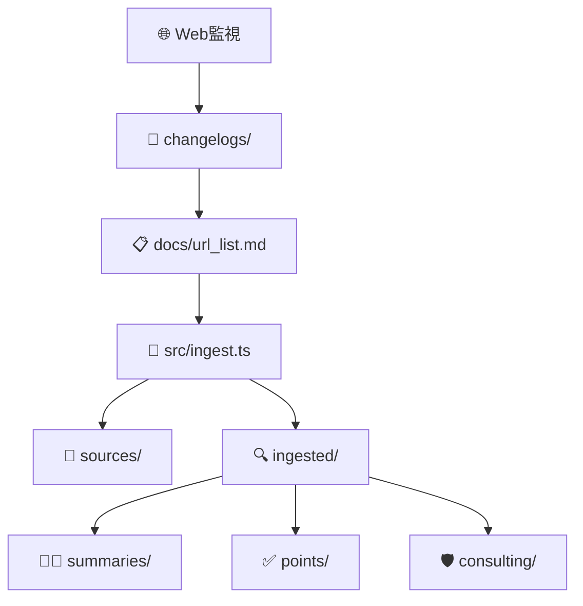

# APPI 関連法令ナレッジベース

日本の個人情報保護法（APPI）および関連法令・ガイドラインの**ローカルナレッジベース**構築・運用システム

## 🎯 目的

- **一次情報の体系的収集**: 官公庁・独法・官報等からの原文取得
- **教師モード**: 初学者向けの噛み砕き要約・用語定義
- **コンサルモード**: 実装・監査で使えるチェックリスト・コントロール表
- **更新追跡**: 法改正・ガイドライン変更の継続監視

## 🚀 クイックスタート

### 🐳 Devcontainer（推奨）

```bash
# VS Code でリポジトリを開く
code .

# コマンドパレット (Ctrl/Cmd + Shift + P)
> Dev Containers: Reopen in Container

# コンテナ起動後、自動で npm install & build 実行
# 準備完了！
npm run ingest
```

### 💻 ローカル環境

```bash
# 依存関係インストール
npm install

# TypeScriptビルド
npm run build
```

### 法令データ取得

```bash
# docs/url_list.md に基づいて全件取得
npm run ingest

# 進捗確認
ls sources/    # 元ファイル（PDF/HTML）
ls ingested/   # 抽出済みテキスト（JSON）
```

## 📁 ディレクトリ構成

```
├── docs/url_list.md        # 📋 取得対象URL一覧（唯一の真実のソース）
├── src/                    # 💻 TypeScriptソースコード
│   ├── ingest.ts          #    メイン取得スクリプト
│   ├── types.ts           #    Zod型定義・スキーマ
│   ├── utils.ts           #    ユーティリティ（slug生成等）
│   ├── parsers.ts         #    Markdown/データ解析
│   └── extractors.ts      #    PDF/HTML抽出エンジン
├── sources/               # 📄 元資料（PDF/HTML保存）
├── ingested/              # 🔍 抽出済みテキスト（JSON形式）
├── summaries/             # 👨‍🏫 教師ロール要約
├── points/                # ✅ 重要ポイント抽出（監査用）
├── consulting/            # 🛡️ セキュリティコンサル助言
├── changelogs/            # 📅 法改正・更新追跡
├── schemas/               # 📐 JSONスキーマ定義
├── newswatch/             # 📰 最新動向監視
└── indices/               # 📚 用語集・逆引き索引
```

## 🔄 データフロー



## 📖 使用方法

### 1. URL 追加・管理

```bash
# docs/url_list.md を編集
echo "| 新しい法令 | https://example.gov.jp/law.pdf |" >> docs/url_list.md

# 差分取得
npm run ingest
```

### 2. 要約・ポイント抽出（今後実装）

```bash
# 教師モード要約生成
npm run summarize

# 監査ポイント抽出
npm run extract-points

# セキュリティコントロール表作成
npm run consulting
```

## 🏗️ 技術スタック

### 🐳 開発環境

- **Devcontainer**: VS Code 統合開発環境
- **Docker**: コンテナ化された統一環境
- **Base Image**: Microsoft 公式 TypeScript/Node.js イメージ

### 言語・ランタイム

- **Node.js** 20+ / **TypeScript** 5+
- **ES Modules** + **Strict TypeScript**

### 主要ライブラリ

- **axios**: HTTP 通信・ファイルダウンロード
- **cheerio**: HTML 解析・テキスト抽出
- **pdf-parse**: PDF 解析・テキスト抽出
- **zod**: 型安全バリデーション・スキーマ定義
- **gray-matter**: Frontmatter 解析

### 開発ツール

- **tsx**: TypeScript 実行環境
- **ESLint**: 静的解析
- **Jest**: テストフレームワーク

## 📐 スキーマ・型定義

### Frontmatter（全.md ファイル必須）

```yaml
---
doc_type: "summary|points|consulting|changelog"
title: "個人情報の保護に関する法律"
source_url: ["https://elaws.e-gov.go.jp/..."]
source_org: ["個人情報保護委員会"]
source_type: "law|guideline|faq|ruling"
source_date: "2024-01-01"
retrieved_at: "2024-01-01"
tags: ["APPI", "越境移転", "委託"]
confidence: 0.95
---
```

### IngestedDocument（JSON 形式）

```typescript
interface IngestedDocument {
  slug: string; // ファイル識別子
  source_info: SourceInfo; // URL・取得メタデータ
  extraction_meta: ExtractionMeta; // 抽出結果・エラーログ
  content: ExtractedContent; // テキスト・ページ情報
}
```

## 🛡️ セキュリティ・コンプライアンス

### 取得制限

- ✅ robots.txt 遵守
- ✅ レート制限（1 秒間隔）
- ✅ タイムアウト設定（30 秒）
- ✅ 有料コンテンツ除外
- ✅ chrome-extension URL 拒否

### データ保護

- ✅ ローカル保存のみ（外部送信なし）
- ✅ 一次情報 URL 必須記録
- ✅ 取得失敗ログ保存

## 🔍 品質管理

### バリデーション

- **JSON スキーマ適合性**: 全データファイル
- **Frontmatter 必須項目**: 全 Markdown ファイル
- **リンク生存確認**: 定期チェック
- **重複コンテンツ検出**: slug 衝突回避

### セルフレビュー項目

- [ ] 一次情報 URL の生存確認
- [ ] 日付・版数の明記
- [ ] 根拠条文の紐づけ
- [ ] 推測/私見のラベル付け
- [ ] 初学者向けの前提説明
- [ ] 実装者向けのチェックリスト

## 📅 運用・メンテナンス

### 定期実行

```bash
# 週次: 新着チェック
npm run newswatch

# 月次: 全URL再取得
npm run ingest --force

# 四半期: 要約全面見直し
npm run review-all
```

### 更新フロー

1. **検知**: 省庁サイト監視・パブコメ追跡
2. **追加**: `docs/url_list.md` 編集
3. **取得**: `npm run ingest` 実行
4. **要約**: Teacher/Consultant モード生成
5. **記録**: `changelogs/` に影響分析

## ⚖️ 免責事項

**重要**: 本システムは情報収集・整理を目的としており、法的助言を提供するものではありません。最終的な法的判断は必ず専門家にご相談ください。

- 一次情報の解釈・適用は自己責任
- 法改正・ガイドライン変更の反映にタイムラグあり
- 機械的抽出による誤読・欠落の可能性

## 🤝 コントリビューション

### 🐳 開発環境セットアップ

```bash
# 1. リポジトリフォーク・クローン
git clone <your-fork-url>
cd appi-related-laws

# 2. VS Code でDevcontainer起動
code .
> Dev Containers: Reopen in Container

# 3. 開発開始
npm run dev
```

### URL 追加・修正

1. `docs/url_list.md` を Markdown テーブル形式で編集
2. Pull Request 作成
3. 取得テスト・品質確認後マージ

### 機能追加・バグ修正

1. Issue 作成（機能要求・バグ報告）
2. Fork → 開発 → Pull Request
3. `.cursor/rules/` のコーディング規約遵守

### 🔧 開発ツール・規約

- **Devcontainer**: 統一開発環境
- **ESLint + Prettier**: コード品質・フォーマット
- **TypeScript Strict**: 型安全性
- **テスト**: Jest 単体テスト

## 📞 サポート・お問い合わせ

- **Issues**: バグ報告・機能要求
- **Discussions**: 使い方・運用相談
- **Wiki**: 詳細ドキュメント・FAQ

---

**Built with ❤️ for APPI compliance professionals**

## 🧭 ステータス管理ルール（status.csv 準拠）

- 生成状況の可視化

  - 実行: `./scripts/generate_status.sh`
  - 出力: `docs/status.csv`, `docs/status.md`
  - 備考: `-` は対象外（skip/N/A）。

- ルール（summary 以降の処理）

  - 以降の作業（`summaries/`, `points/`, `consulting/`）は、`docs/status.csv` を基に未処理（`×`）のスラッグを対象に実施する。
  - 処理完了のたびに `./scripts/generate_status.sh` を再実行し、`docs/status.csv`/`docs/status.md` を更新する。
  - `-` は skip/N/A を意味するため対象外とし、対応しない。

- 例（未処理一覧の抽出）
  - 要約が未処理:
    ```bash
    awk -F, 'NR>1 && $3=="◯" && $4=="×" {print $1}' docs/status.csv
    ```
  - ポイントが未処理:
    ```bash
    awk -F, 'NR>1 && $3=="◯" && $5=="×" {print $1}' docs/status.csv
    ```
  - コンサル助言が未処理:
    ```bash
    awk -F, 'NR>1 && $3=="◯" && $6=="×" {print $1}' docs/status.csv
    ```
